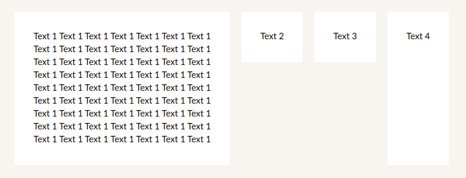

### Description
This iS just a box with predefined margins and paddings, with white bg color by default, and this block fits its content (some times it is a case)

### Usage
```
<Box bgFullWidth='primary' css={{height: 500}}>
  <FlexLayout>
    <Card as='section'>
      <FlexLayout flexDirection='column'>
        <Text>Text 1 Text 1 Text 1 Text 1 Text 1 Text 1 Text 1</Text>
        <Text>Text 1 Text 1 Text 1 Text 1 Text 1 Text 1 Text 1</Text>
        <Text>Text 1 Text 1 Text 1 Text 1 Text 1 Text 1 Text 1</Text>
        <Text>Text 1 Text 1 Text 1 Text 1 Text 1 Text 1 Text 1</Text>
        <Text>Text 1 Text 1 Text 1 Text 1 Text 1 Text 1 Text 1</Text>
        <Text>Text 1 Text 1 Text 1 Text 1 Text 1 Text 1 Text 1</Text>
        <Text>Text 1 Text 1 Text 1 Text 1 Text 1 Text 1 Text 1</Text>
        <Text>Text 1 Text 1 Text 1 Text 1 Text 1 Text 1 Text 1</Text>
        <Text>Text 1 Text 1 Text 1 Text 1 Text 1 Text 1 Text 1</Text>
      </FlexLayout>
    </Card>
    <Card as='section'><Text>Text 2</Text></Card>
    <Card as='section'><Text>Text 3</Text></Card>
    <Card as='section' variant='grow'><Text>Text 4</Text></Card>
  </FlexLayout>
</Box>
```


