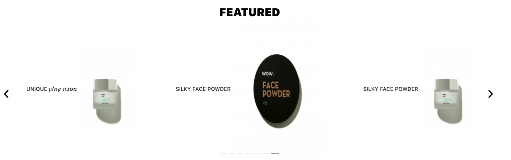

## General overview
Carousel component is used for cycling through slides.
In current implementation it uses [swiperjs library](https://swiperjs.com/react/).

There are 2 types of carousel
1) Banner carousel


```js
<Carousel type='banner' bannersList = {} />
````

2) Product list carousel

```js
<Carousel type='product' products={} />
````
