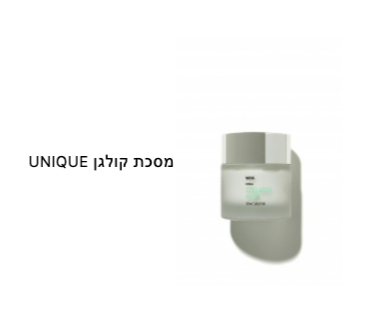

## General overview
Featured product component is part of Product Carousel component. It displays image and title of product.



### How to use

```jsx
 <FeaturedProduct code={product.code} title={product.title} url={product.url} media={product.media} />
```

```js
interface IFeaturedProduct {
  code: string;
  title: string;
  url: string;
  media: {
    altText: string;
    mime: string;
    url: string;
  }
}
```