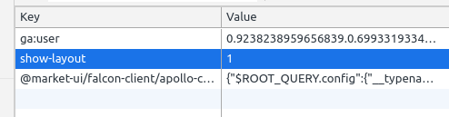
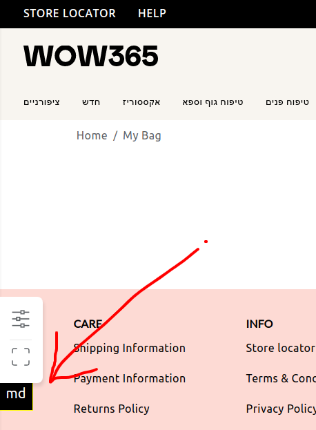

# how to use

to enable this logger, you need to add `show-layout: 1` to localStorage



#### how to install it (once in the project)
```jsx harmony
let LayoutLoggerComponent;

if (process.env.NODE_ENV !== 'production') {
  LayoutLoggerComponent = LayoutLogger;


const App = () => (
    <Layout>
        {LayoutLoggerComponent && <LayoutLogger side="left" />}
    </Layout>
);
```
