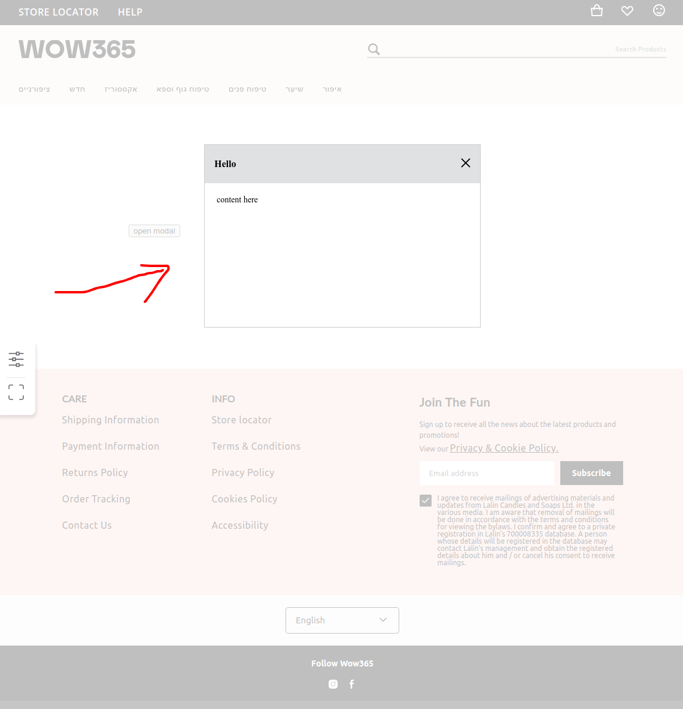

# how to use
```jsx harmony
export {useModalContext} from 'src/components';

const ModalContent = () => (
    <div style={{ height: 200, width: 200 }}>content here</div>
);

const Foo = () => {
    const {openModal} = useModalContext();
    
    const openConcreteModal = useCallback((e) => {
        e.preventDefault();
        
        openModal('Hello', ModalContent);
    });
    
    return (
        <button onClick={openConcreteModal}>open modal</button>
    );
};
```


#### global installation (doing once in the project)
> The main idea Modal should be inside of ModalContextProvider
```jsx harmony
const App = () => (
    <ModalContextProvider>
        <Layout>
            <Modal />
            // OtherComponents
        </Layout>
    </ModalContextProvider>
);
```
