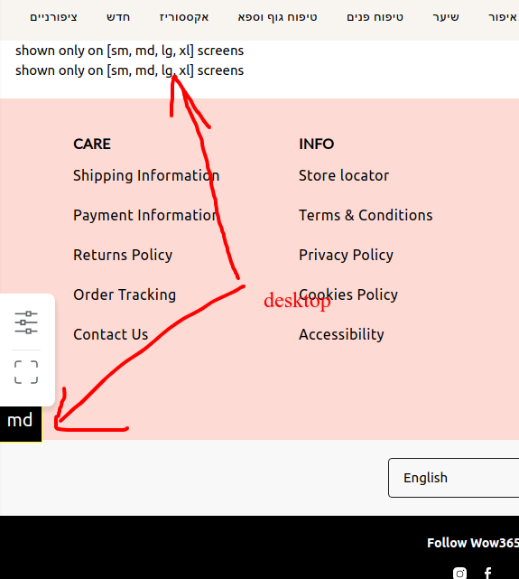

# how to use

```jsx harmony
const Foo = () => {
    return (
        <React.Fragment>
            <ResponsiveIf minWidth='sm'>
                shown only on [sm, md, lg, xl] screens
            </ResponsiveIf>
            <ResponsiveIf desktop>
                shown only on [sm, md, lg, xl] screens
            </ResponsiveIf>
            
            <ResponsiveIf maxWidth='sm'>
                shown only on [xs] screens
            </ResponsiveIf>
            <ResponsiveIf mobile>
                shown only on [xs] screens
            </ResponsiveIf>
        </React.Fragment>
    );
};
```

> switch on LayoutLogger to see black box with layout size (read readme of LayoutLogger)



