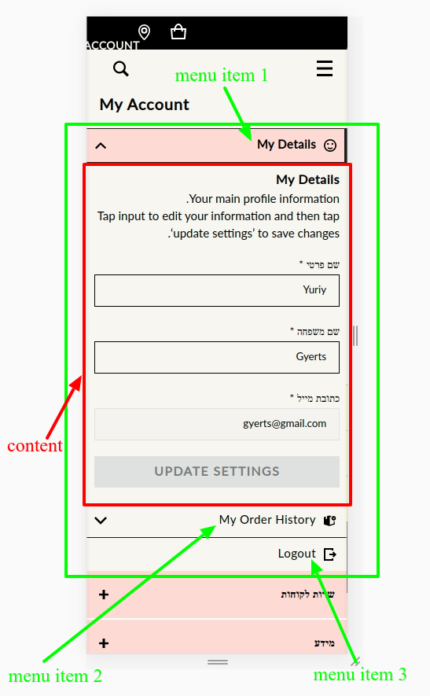
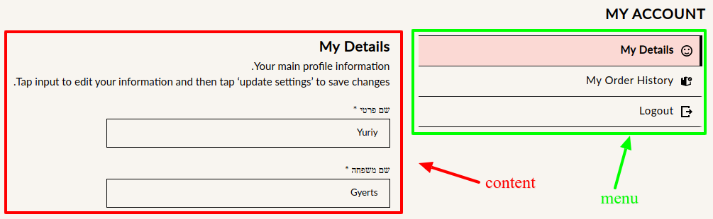

### how to use

```
const Account = () => {
  return (
    <Tabs
      /******************************************************************
       * [screenshot 1] in case of mobile show content-inside of tab, tabs is collapsible menu
       * [screenshot 2] in case of desktop show menu-from-left of content
       ******************************************************************/
      placement={bothResolutions('content-inside', 'menu-from-left')}

      /******************************************************************
       * if you need apply grid layout, to menu and contant, pass it here
       ******************************************************************/
      menuAndContentLayout={menuAndContentLayout}
      
      /******************************************************************
       * when you use menuAndContentLayout, you need also set grid area to menu and content
       ******************************************************************/
      menuGridArea={area.menu}
      contentGridArea={area.content}
      
      /******************************************************************
       * tabs is thamable component, you can set any thamable props here
       ******************************************************************/
      gridArea={area.content}
    >
      /******************************************************************
       * register links, each registered link is a Router component,
       * each registered link will shown as menu item
       * attribute to will compared to url and if it is equal, it means this menu is active
       ******************************************************************/
      <TabLink to="/account/details">
        <Link as={RouterLink} to="/account/details"> Details menu item </Link>
      </TabLink>
      <TabLink to="/account/orders">
        <Link as={RouterLink} to="/account/orders">  Orders menu item  </Link>
      </TabLink>
      <TabLink to="/account" collapsible={false}>
        <Botton variant='link' onClick={doLogout}>   logout menu item  </Link>
      </TabLink>
    
      /******************************************************************
       * TabRoute is instance of Route (react-router-dom), we need to wrap it to register content. 
       * Where content will be placed, read Tabs.placement attr notation.
       * TabRoute.path should be equal to TabLink.to, otherwice link will not be connected to the content
       ******************************************************************/
      <TabRoute exact path="/account/details" component={MyDetails} />
      <TabRoute exact path="/account/orders" component={OrderHistory} />
      <TabRoute exact path="/account" component={() => <Redirect to='/account/details' />} />
    </Tabs>
  );
}

const area = {
  empty: '.',
  breadcrumbs: 'breadcrumbs',
  title: 'title',
  menu: 'menu',
  content: 'content',
};

const menuAndContentLayout: DefaultThemeProps = {
  accountLayout: {
    display: 'grid',
    gridGap: {
      md: 'xl',
      sm: 'sm',
    },
    // prettier-ignore
    gridTemplate: {
      xl: toGridTemplate([
        ['1fr',      '400px',    '700px',      '1fr'      ],
        [area.empty, area.menu,  area.content, area.empty ],
      ]),
      lg: toGridTemplate([
        ['1fr',      '400px',    '700px',      '1fr'      ],
        [area.empty, area.menu,  area.content, area.empty ],
      ]),
      md: toGridTemplate([
        ['400px',    '700px'      ],
        [area.menu,  area.content ],
      ]),
      sm: toGridTemplate([
        ['1.5fr',     '2fr'       ],
        [area.menu,  area.content ],
      ]),
      
      /******************************************************************
       * do not apply xs here if Tabs.placement.xs === 'content-inside'
       ******************************************************************/
    }
  }
};
```

## screenshot 1 [content-inside]


## screenshot 2 [menu-from-left]

