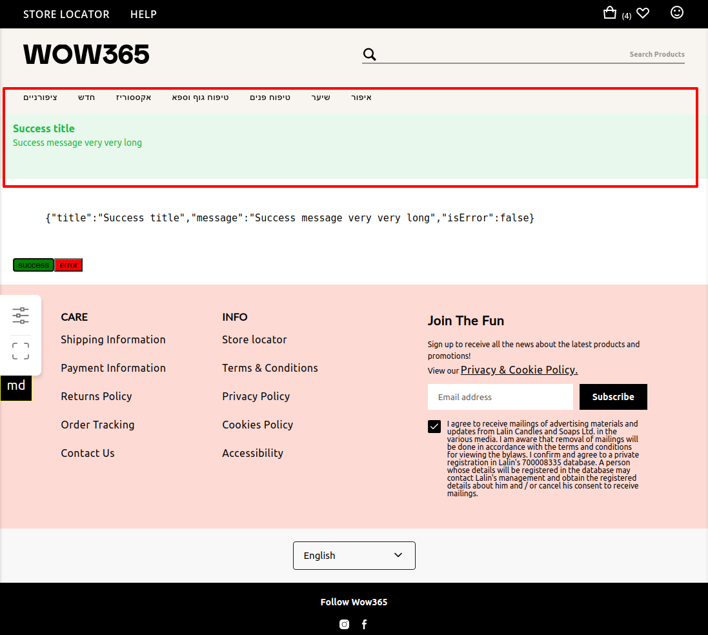
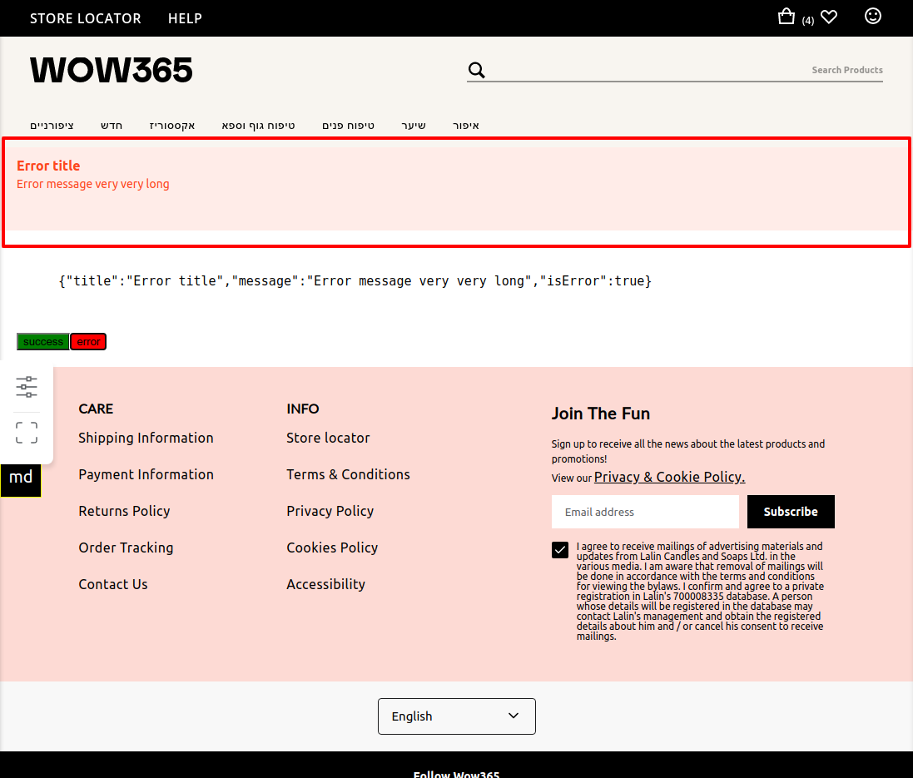

# how to use

```jsx harmony
const Component = () => {
  return (
    <TopPageMessageContextProvider>
      <ComponentImpl />
    </TopPageMessageContextProvider>
  )
};

const ComponentImpl = () => {
  const { openMessage } = useTopPageMessageContext();

  const openSuccessMessage = useCallback(function () {
    openMessage(
      /* title */   'Success title',
      /* message */ 'Success message very very long',
      /* options */  {
        isError: false,
        closable: false,
        autoClose: true,
      },
    );
  }, []);

  const openErrorMessage = useCallback(function () {
    openMessage(
      /* title */   'Error title',
      /* message */ 'Error message very very long',
      /* options */  {
        isError: true,
        closable: false,
        autoClose: true,
      }
    );
  }, []);


  return (
    <div>
      <TopPageMessage onClose={() => alert('closed')} />
      <button style={{backgroundColor: 'green'}} onClick={openSuccessMessage}>success</button>
      <button style={{backgroundColor: 'red'}} onClick={openErrorMessage}>error</button>
    </div>
  );
};

```


