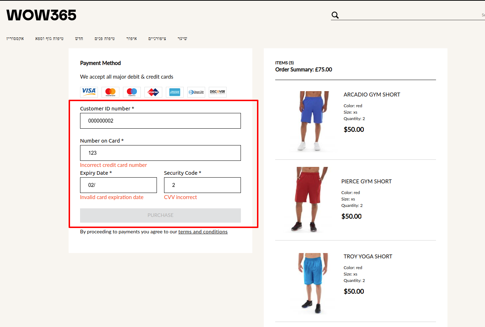

## Tranzila plugin
This plugin implements next requirement
1) implement nice form according to the design
2) shows relevant errors while communication with Tranzila service
3) if all data is correct, makes authorization request to tranzila service, and returns to the parent required data to identify payment

## response (can vary)
```
export interface IChargeResponse {
  success: boolean,                  // Boolean. Can be true o false
  error: string,                     // Shva error message translated to language selected in reponse_language parameter

  transaction_id: string,            // Transaction unique ID in Tranzila gateway

                                     // The transaction id, should be send to the server so that it will
                                     // be possible to capture the payment later on in the shipping process.

  amount: string,                    // Transaction amount
  currency_code: number,             // Transaction currency code
  credit_card_last_4_digits: string, // Credit card last 4 digits
  token: string,                     // Credit card token if requested in tokenize parameter
  user_form_data: [],                // Container for all ‘non-hosted’ fields sent in request
  confirmation_code : string
}
```

DOCS: https://camdenmarket.atlassian.net/wiki/spaces/FDD/pages/1295974485/Tranzila+Integration


